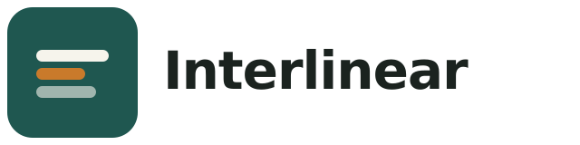

<p align="center">
  
</p>

<p align="center">
  Cross-language cheat sheets, line by line.<br />
  One code sample. Every natural language, aligned.
</p>

<p align="center">
  <a href="LICENSE"></a>
  
  
</p>

---

## What this is

[`learnxinyminutes.com`](https://learnxinyminutes.com) proved that a single,
comment-driven code file is one of the fastest ways to learn a programming
language's syntax. **Interlinear** takes that same format and adds a second
axis: **natural language**.

Every tutorial is a real, runnable code file, annotated entirely through
comments — exactly like the original. The difference is that each one exists
in parallel across multiple natural languages (Japanese, English, ...), and
switching between them is instant: no page reload, no layout shift, just a
tab click.

The name comes from [*interlinear gloss*](https://en.wikipedia.org/wiki/Interlinear_gloss),
the linguistics convention of stacking translation directly beneath a source
text, line for line. That's the mental model here — the "gloss" is just
attached to code instead of prose.

## Why it's built this way

- **Content is the product.** There's no CMS, no database, no client-side
  framework runtime. A tutorial is a Markdown file with a fenced code block.
  Astro's [Content Layer](https://docs.astro.build/en/guides/content-collections/)
  turns that into a type-checked, statically-generated page at build time.
- **The locale switch ships almost no JS.** Every language variant is
  pre-rendered into the page at build time; a ~40-line vanilla script just
  toggles `hidden` on the matching `<article>` and remembers the choice in
  `localStorage`. No hydration, no framework, no flash of the wrong language.
- **Adding a language is a filesystem operation.** New programming language
  or new natural language — both are just new files under
  `src/content/tutorials/`. Routing, the homepage index, and the locale tabs
  are all derived from the content collection; nothing to wire up by hand.

## Quickstart

```bash
git clone https://github.com/<you>/interlinear.git
cd interlinear
npm install
npm run dev      # → http://localhost:4321
```

```bash
npm run build     # → dist/ (fully static)
npm run preview   # serve the production build locally
```

Requires Node `>=22.12.0`.

## Project layout

```
src/
  content/
    tutorials/
      python/
        ja.md            # 日本語版
        en.md            # English
      javascript/
        ja.md
        en.md
  content.config.ts       # zod schema for the tutorials collection
  layouts/
    Base.astro             # header / footer shell
  pages/
    index.astro             # language index (home)
    [lang].astro              # per-language page + locale tab switcher
  styles/
    global.css                # design tokens (color, type, spacing)
assets/
  brand/                       # logo source files, see BRANDING.md
```

## Adding a programming language

Create a directory under `src/content/tutorials/<slug>/` and drop in one
Markdown file per locale (`ja.md`, `en.md`, ...). That's it — the homepage
and `/<slug>` route are generated automatically from whatever exists in the
content collection.

Frontmatter shape:

````md
---
title: "Rust"
lang: "rust"                 # becomes the URL: /rust
locale: "ja"                  # must match content.config.ts's enum
localeLabel: "日本語"
filename: "learnrust.rs"       # shown in the code pane's title bar
codeLang: "rust"                # for syntax highlighting
---

```rust
// comment-driven code goes here, exactly like learnxinyminutes
```
````

## Adding a natural language

1. Add the locale to the `z.enum([...])` in `src/content.config.ts`.
2. Add it to the `order` array in `src/pages/[lang].astro` (controls tab order).
3. Add a matching Markdown file to every programming-language directory you
   want it to cover.

The new tab appears automatically wherever content exists for it — partial
coverage (e.g. a language only translated for Python, not yet for
JavaScript) is expected and fine.

## Design

Visual identity is documented in [`assets/brand/BRANDING.md`](assets/brand/BRANDING.md),
including the reasoning behind the mark and how to export it for other
surfaces (favicons, social cards, npm, etc).

## Roadmap

- [ ] More programming languages (Rust, Go, TypeScript are natural next steps)
- [ ] More locales (target: Simplified Chinese, Korean, Spanish)
- [ ] Community contribution flow (issue template for "translate this tutorial")
- [ ] Search across all languages / locales
- [ ] `rss`/`llms.txt` export of the raw tutorial corpus

## Contributing

Issues and PRs welcome — especially new locale translations, since those are
the highest-leverage contribution this project can take. See the sections
above for the exact file shape a contribution needs to take; there's
intentionally no build step or tooling required to write one.

## License

[MIT](LICENSE)
